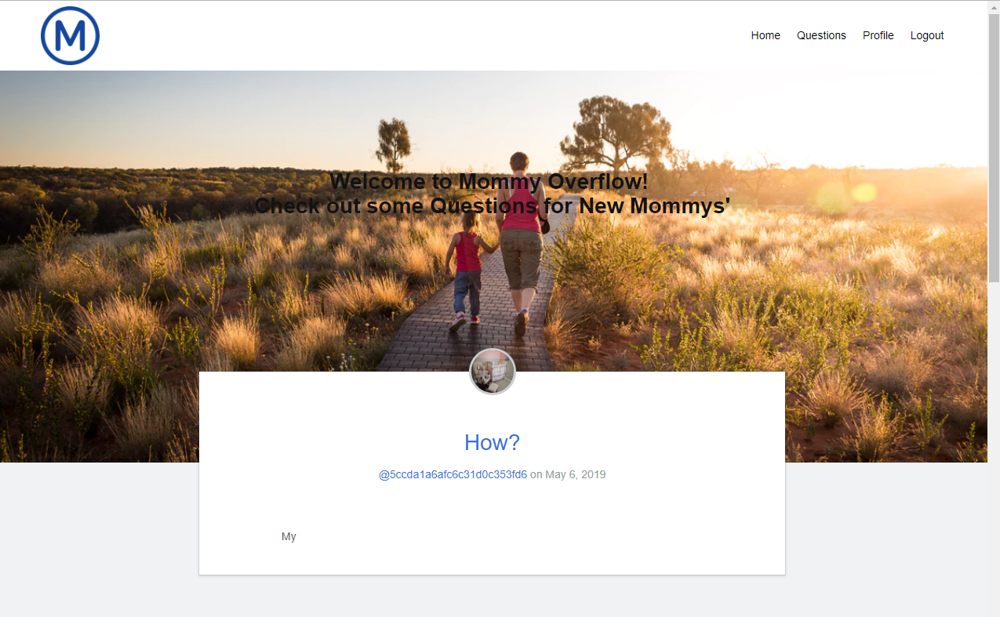
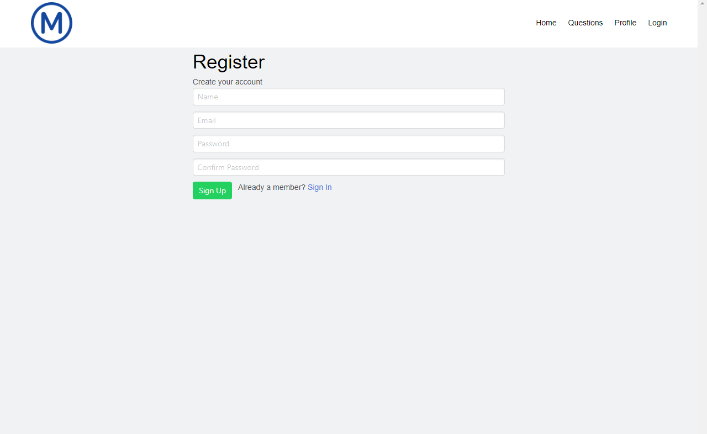
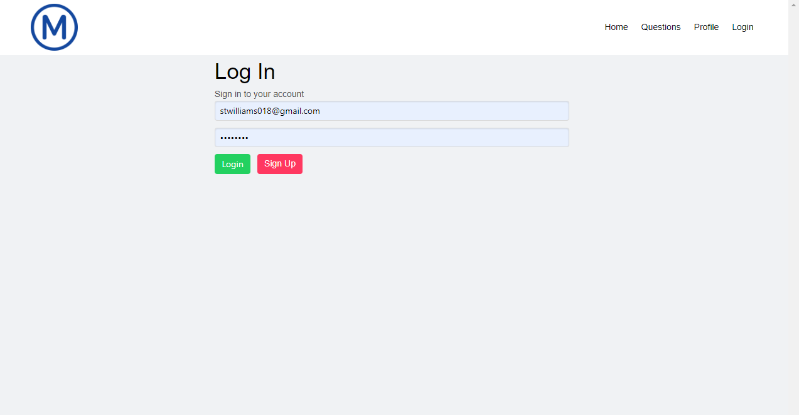
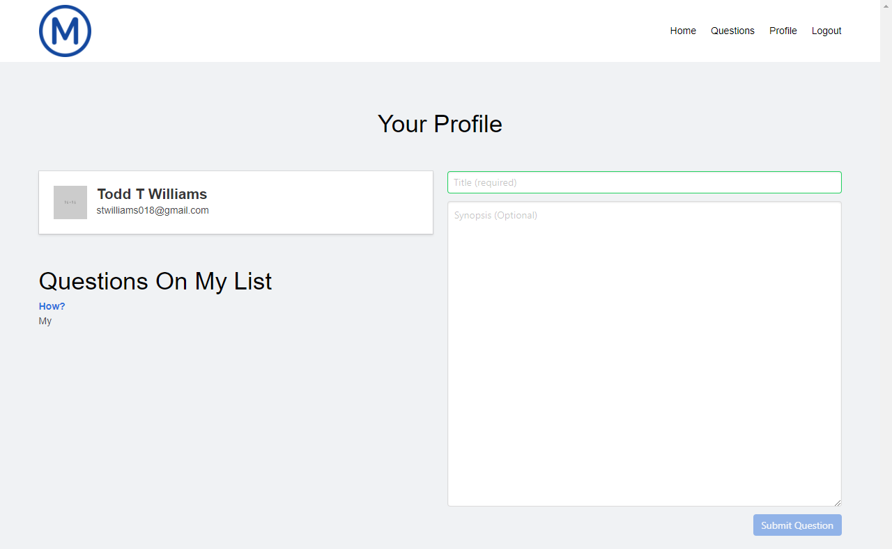
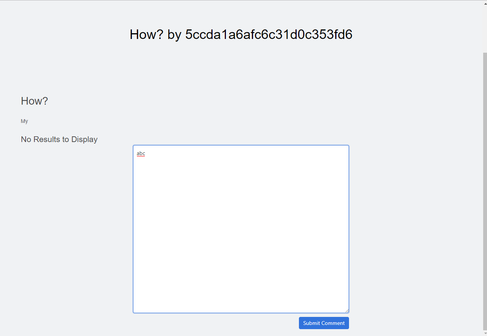

 <h1 align="center"> MommyOverflow</h1>
 <h2 align="center">
 May 4, 2019 Presentation 
 GT Coding Bootcamp Project 2 
 Dalton Hazzard 
 Dylan Pugh 
 Chuck Griffin 
 Todd Williams 
 Eva Khan 
<a href="https://mommyoverflow.herokuapp.com/Questions">Heroku Web Address</a> 
<a href="https://stwilliams018.github.io/MOFPres/">Web Presentation</a>
</h2> 
<h3> For project #3 our group built a react application called MommyOverflow using Mongo and Es6 technology. Mommyoverflow is community discussion board aimed at serving the stressful needs of new mothers. Community members are able post questions conerning the needs of the newborns or simply add thoughful insight or help to those in need.  This concept was loosly based on the StackOverflow discussion board used extensivly by most programmers. We feel this application could vastly improve the lives of an underserved area.
  
Some of the functional parts of the application:
</h3>
<ul>
    <li>User Access Protected Profile</li>
    <li>Common Question Page</li>
    <li>Personalized Questions Page</li>
    <li>Itemized Responses for Each Question Posted</li>
</ul>
<h3>The older technologies applied:</h3>
<ul>
    <li>HTML</li>
    <li>CSS</li>
    <li>Javascript/jQuery</li>
    <li>AJAX, API, JSON</li>
    <li>js.Node</li>
    <li>Express Server</li>
</ul>
<h3>The newer technologies used in the project:</h3>
    <ul>
        <li >Mongo DB with Mongoose</li>
        <li >React based Application</li>
        <li >New ES6 Javascript</li>
        <li  >Passport.js - Authentification</li>
        <li >GraphQL - API Query Language</li>
        <li >Bulma - CSS Framework</li>
        <li >Reveal.js -Presentation Application</li>
    </ul>
<h3>These are some of the future developments we hope to include in the future:</h3>
<ul>
    <li>API Call grab outside data for issues submitted</li>
    <li>Comment update email alerts to user who posted orginal question</li>
    <li>Ratings for each comment posted on question</li>
    <li>Clickable images for body parts to search for related questions</li>
</ul>
<h3>
A few screenshots from the application to describe functionality:
</h3>
<h3>
First the homepage: 
 
Now the signup Page: 
 
The login Page: 
 
The Profile Page: 

The Comment Page: 

</h3>
